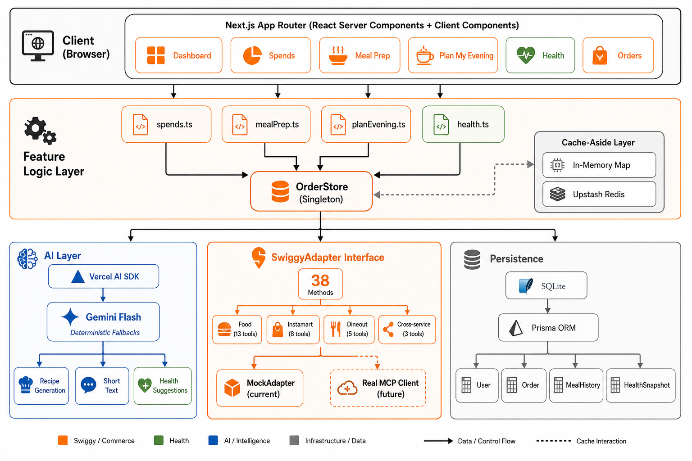
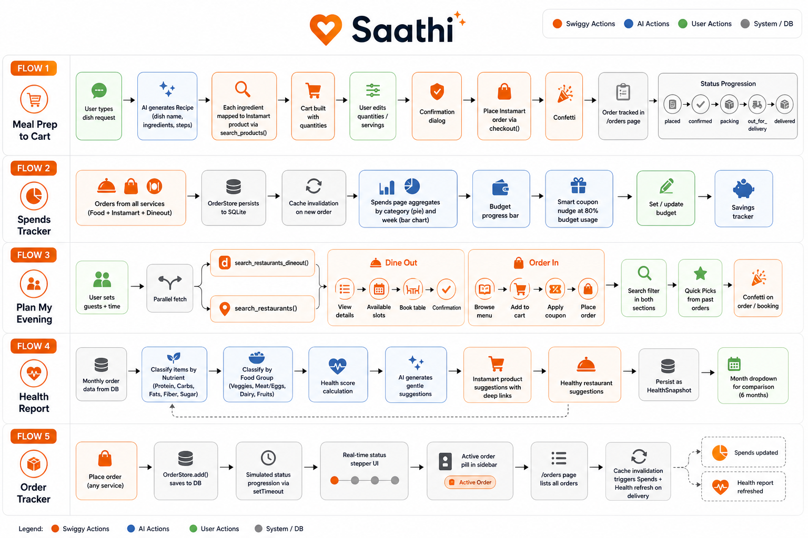

# Saathi — AI Food & Grocery Companion on Swiggy

**Saathi** (meaning "companion" in Hindi) is an intelligent portal built on top of **Swiggy's MCP (Model Context Protocol) tools** that unifies food ordering, grocery shopping, restaurant bookings, spend tracking, and health awareness into a single, beautiful experience.

> Built for the **Swiggy Builders Club** — demonstrating how Swiggy's Food, Instamart, and Dineout MCP tools can power entirely new consumer experiences when combined with AI and smart data aggregation.

---

## The Problems We Solve

| Problem | How Saathi Helps |
|---|---|
| **Scattered spending** — Users order across Food, Instamart, and Dineout but have no unified view of what they spend | A real-time **Spends Tracker** that aggregates across all three verticals, sets budgets, and nudges savings |
| **Recipe-to-cart friction** — Wanting to cook at home means manually searching for each ingredient on Instamart | **Meal Prep to Cart** turns a plain-English recipe request into a ready-to-checkout Instamart cart in seconds |
| **Evening planning is fragmented** — Deciding between dining out or ordering in means switching between multiple flows | **Plan My Evening** surfaces dine-out restaurants with live table slots AND delivery options side-by-side |
| **No health awareness** — Frequent ordering without understanding nutritional patterns | A gentle **Health Report** that classifies past orders by nutrients and food groups, scores your month, and suggests healthier options from Instamart and restaurants |
| **No unified order tracking** — Orders from different services tracked in different places | An **Order Tracker** with real-time status progression, active order pills in the sidebar, and a unified `/orders` page |

---

## Swiggy MCP Tools — What's Available

Swiggy's [Builders Club](https://mcp.swiggy.com/builders) exposes MCP tools across three verticals. Saathi maps all of them through a unified `SwiggyAdapter` interface (29 methods):

### Food (12 tools)
| Tool | Purpose | Used In |
|---|---|---|
| `search_restaurants` | Discover restaurants by query | Plan My Evening (Order In section) |
| `get_restaurant_menu` | Fetch full menu for a restaurant | Plan My Evening (Menu page) |
| `search_menu` | Search across menus | Adapter (wired, not yet surfaced) |
| `update_food_cart` | Add/update items in food cart | Plan My Evening (Menu → Cart) |
| `get_food_cart` | Retrieve current food cart state | Plan My Evening (Cart bar) |
| `flush_food_cart` | Clear the food cart | Adapter (wired) |
| `fetch_food_coupons` | Get available coupons for cart total | Spends (nudge), Plan My Evening (Checkout) |
| `apply_food_coupon` | Apply a coupon to the cart | Plan My Evening (Checkout) |
| `place_food_order` | Place the food order | Plan My Evening (Checkout) |
| `track_food_order` | Track a specific food order | Order Tracker |
| `get_food_orders` | List all food orders | Orders page |
| `get_food_order_details` | Get details of a specific order | Orders page |

### Instamart (9 tools)
| Tool | Purpose | Used In |
|---|---|---|
| `search_products` | Search Instamart products by keyword | Meal Prep (ingredient → product mapping) |
| `your_go_to_items` | Get user's frequently ordered products | Adapter (wired) |
| `update_cart` | Add/update Instamart cart items | Meal Prep (Add to Cart) |
| `get_cart` | Get current Instamart cart | Meal Prep (Cart state) |
| `clear_cart` | Clear the Instamart cart | Adapter (wired) |
| `checkout` | Place Instamart order | Meal Prep (Place Order) |
| `track_order` | Track Instamart order | Order Tracker |
| `get_orders` | List Instamart orders | Orders page |
| `get_order_details` | Get details of a specific Instamart order | Orders page |

### Dineout (5 tools)
| Tool | Purpose | Used In |
|---|---|---|
| `search_restaurants_dineout` | Find dine-out restaurants | Plan My Evening (Dine Out section) |
| `get_restaurant_details` | Detailed info (address, timings, deals) | Plan My Evening (Expandable cards) |
| `get_available_slots` | Fetch table availability by date | Plan My Evening (Slot selection) |
| `book_table` | Reserve a table | Plan My Evening (Book with confirmation) |
| `get_booking_status` | Track a booking | Adapter (wired) |

### Cross-service (3 tools)
| Tool | Purpose |
|---|---|
| `get_addresses` | Retrieve saved addresses |
| `create_address` | Add a new address |
| `delete_address` | Remove an address |

---

## Architecture



### Stack

| Layer | Technology | Why |
|---|---|---|
| **Framework** | Next.js 15 (App Router) + TypeScript | Server Components for fast initial loads, Server Actions for mutations, single deploy target |
| **Styling** | Tailwind CSS 3 + custom design tokens | Swiggy-inspired brand palette, zero CSS files to manage |
| **Database** | SQLite + Prisma 7 (via `better-sqlite3` adapter) | Zero-config local persistence, instant queries, no external DB service needed |
| **Cache** | In-memory Map (dev) / Upstash Redis (prod) | Cache-aside pattern with TTL; `invalidateByPrefix()` for surgical cache busting |
| **AI** | Vercel AI SDK + Google Gemini Flash | Structured output via `generateObject()` with Zod schemas; every AI call has a deterministic fallback |
| **Charts** | Recharts | Spend breakdown (bar), health trend (area) |
| **Icons** | Lucide React | Consistent, tree-shakeable icon set |
| **Validation** | Zod 4 | Schema-first: recipe structure, API contracts |

### Key Architectural Decisions

**1. SwiggyAdapter Pattern (Dependency Inversion)**
```
src/lib/swiggy/adapter.ts    → Interface (29 methods mirroring MCP tools)
src/lib/swiggy/mock-adapter.ts → Mock implementation with seeded data
src/lib/swiggy/index.ts       → Factory: reads SWIGGY_DATA_SOURCE env var
```
The entire app codes against `SwiggyAdapter`. Switching from mock to real MCP requires implementing one file — zero feature code changes.

**2. OrderStore Singleton (Event-Driven Cross-Feature Updates)**
```
Order placed → OrderStore.add()
  → Persists to SQLite
  → Invalidates spends cache (invalidateByPrefix("spends:"))
  → Schedules status progression (setTimeout chain)
  → On "delivered": invalidates health snapshot for that month
  → Notifies sidebar via pub/sub (active order pill)
```

**3. AI with Graceful Degradation**
Every AI-powered feature has a deterministic fallback. The app is 100% functional with `GOOGLE_GENERATIVE_AI_API_KEY` unset:

| Feature | With AI | Without AI |
|---|---|---|
| Recipe generation | Gemini parses free text into structured recipe | Keyword-matched fallback book (5 recipes) |
| Evening plan reason | AI-written one-liner | Static "Well-rated spots..." |
| Health suggestions | AI-generated gentle tips | Rule-based suggestions |

**4. Dual Classification System (Health)**
- **Nutrient-based** (Protein, Carbs, Fats, Fiber, Sugar) — drives the balance bar visualization
- **Food-group-based** (Veggies, Meat/Eggs, Dairy, Fruits) — drives actionable suggestions (Instamart products, healthy restaurants)

---

## Use-Case Flows



### Flow 1: Meal Prep to Cart
```
User prompt ("Butter Chicken for 4")
  → AI (or fallback) generates Recipe with ingredients + steps
  → Each ingredient → swiggy.search_products() → best match
  → Cart built automatically (editable quantities/servings)
  → Confirmation dialog
  → swiggy.checkout() places Instamart order
  → Confetti animation → Order tracked in /orders
  → Status: placed → confirmed → packing → out_for_delivery → delivered
```

### Flow 2: Spends Tracker
```
All orders (Food + Instamart + Dineout) stored in SQLite
  → Aggregated by category (pie chart) and week (bar chart)
  → Budget progress bar with user-configurable monthly budget
  → Smart coupon nudge when usage hits 80%
  → Total savings tracker (discounts across all orders)
  → Real-time updates via cache invalidation on new orders
```

### Flow 3: Plan My Evening
```
User sets guests (stepper) + time (dropdown)
  → Parallel: search_restaurants_dineout() + search_restaurants()
  → Dine Out section: expandable cards → view details → see slots → book table
  → Order In section: browse menu → add to cart → apply coupon → place order
  → Search filters in both sections
  → Quick Picks from past order history
  → Confirmation dialogs for both booking and ordering
```

### Flow 4: Health Report
```
Monthly orders from DB
  → Classify by Nutrient (balance bar) + Food Group (suggestion cards)
  → Compute health score (veggie variety, hydration, home-cooked ratio)
  → AI generates 3 gentle, non-judgmental suggestions
  → Surface Instamart products to fill nutritional gaps (deep links)
  → Suggest healthy restaurants
  → Persist as HealthSnapshot → Month dropdown for 6-month comparison
```

### Flow 5: Order Tracker
```
Order placed from any feature (Meal Prep, Plan Evening)
  → OrderStore.add() → SQLite + in-memory tracking
  → Simulated status progression (setTimeout chain with realistic delays)
  → Real-time stepper UI on /orders page
  → Active order pill in sidebar
  → On delivery: cascade cache invalidation → Spends + Health auto-refresh
```

---

## Project Structure

```
src/
├── app/                          # Next.js App Router pages
│   ├── page.tsx                  # Dashboard (home)
│   ├── layout.tsx                # Root layout (Sidebar + TopBar)
│   ├── globals.css               # Tailwind + design tokens
│   ├── api/
│   │   ├── orders/route.ts       # GET — order polling (version + active orders)
│   │   └── user/budget/route.ts  # PATCH — update monthly budget
│   ├── spends/
│   │   ├── page.tsx              # Spends tracker
│   │   └── BudgetEditor.tsx      # Inline budget editor
│   ├── meal-prep/
│   │   ├── page.tsx              # Meal Prep UI
│   │   ├── MealPrepClient.tsx    # Interactive recipe + cart client
│   │   └── actions.ts            # Server actions (generate, order, history)
│   ├── plan-evening/
│   │   ├── page.tsx              # Plan My Evening (server shell)
│   │   ├── actions.ts            # Server actions (search, book, order, coupons)
│   │   ├── PlanEveningClient.tsx # Main interactive client component
│   │   ├── PreferencesBar.tsx    # Guests stepper + time dropdown
│   │   ├── QuickPicks.tsx        # Past order favorites (horizontal scroll)
│   │   └── menu/[restaurantId]/
│   │       ├── page.tsx          # Restaurant menu (server component)
│   │       └── MenuClient.tsx    # Cart management + checkout + confetti
│   ├── health/
│   │   ├── page.tsx              # Health report UI
│   │   ├── MonthSelector.tsx     # Month dropdown for comparison
│   │   └── SuggestionCards.tsx   # Instamart + restaurant suggestions
│   └── orders/page.tsx           # Unified order tracker
├── components/                   # Shared UI components
│   ├── Sidebar.tsx               # Nav + active order pill + user profile + polling
│   ├── TopBar.tsx                # Location, notifications, user avatar
│   ├── ConfirmDialog.tsx         # Reusable confirmation modal
│   ├── OrderStatusStepper.tsx    # Visual multi-step status progression
│   ├── ScoreRing.tsx             # Animated SVG health score ring
│   ├── PageHeader.tsx            # Consistent page headers
│   └── charts/
│       ├── WeeklyBars.tsx        # Recharts bar chart (weekly spend)
│       ├── CategoryDonut.tsx     # Donut chart (spend by service)
│       └── TrendLine.tsx         # Line chart (health trend)
├── lib/
│   ├── swiggy/                   # Swiggy MCP abstraction layer
│   │   ├── adapter.ts            # SwiggyAdapter interface (29 methods)
│   │   ├── mock-adapter.ts       # Mock implementation with seeded data
│   │   ├── types.ts              # Domain types mirroring MCP tool shapes
│   │   ├── seed.ts               # Seed data (restaurants, products, menus)
│   │   └── index.ts              # Adapter factory (mock ↔ mcp switch)
│   ├── features/                 # Business logic per feature
│   │   ├── spends.ts             # Spend aggregation + coupon nudges
│   │   ├── mealprep.ts           # Recipe → cart pipeline
│   │   ├── planEvening.ts        # Evening plan generation
│   │   └── health.ts             # Health report + dual classification
│   ├── ai/                       # AI abstraction layer
│   │   ├── provider.ts           # Model factory (Gemini Flash)
│   │   ├── recipe.ts             # Structured recipe generation + fallback book
│   │   └── explain.ts            # Short text generation helper
│   ├── store/
│   │   └── orderStore.ts         # Order lifecycle + status progression
│   ├── cache.ts                  # Cache-aside (in-memory / Upstash Redis)
│   ├── db.ts                     # Prisma client singleton (better-sqlite3)
│   └── utils.ts                  # cn(), formatINR()
├── generated/prisma/             # Auto-generated Prisma client
prisma/
├── schema.prisma                 # DB schema (User, Order, MealHistory, HealthSnapshot)
├── seed.ts                       # Database seeder (6 months of order history)
└── migrations/                   # Prisma migration history
```

---

## Data Models (Prisma/SQLite)

```prisma
model User {
  id              String           @id @default(cuid())
  name            String
  city            String
  monthlyBudget   Int              @default(8000)
  orders          Order[]
  mealHistory     MealHistory[]
  healthSnapshots HealthSnapshot[]
}

model Order {
  id       String   @id
  userId   String
  service  String                  // "food" | "instamart" | "dineout"
  merchant String
  date     String                  // "2025-06-15"
  amount   Int
  discount Int      @default(0)
  status   String   @default("delivered")
  items    String   @default("[]") // JSON-serialized OrderItem[]
}

model MealHistory {
  id        String   @id @default(cuid())
  userId    String
  dish      String
  servings  Int
  createdAt DateTime @default(now())
}

model HealthSnapshot {
  id        String   @id @default(cuid())
  userId    String
  month     String                  // "2025-06"
  score     Int
  data      String                  // JSON-serialized HealthReport
  @@unique([userId, month])
}
```

---

## Mock Layer — How It Works Without MCP Access

Since Swiggy MCP access is invite-based, the entire app runs on a **mock data layer** that mirrors the exact tool response shapes:

- **Seeded data**: 10 restaurants, 60+ menu items, 20+ Instamart products, 5 dineout venues, 6 months of order history
- **Realistic behavior**: Cart operations maintain state, checkout creates tracked orders, status progresses through realistic timelines
- **Same interface**: `MockAdapter` implements `SwiggyAdapter` — switching to real MCP requires zero feature code changes, only a new adapter implementation

```typescript
// src/lib/swiggy/index.ts — the only file that changes
function selectAdapter(): SwiggyAdapter {
  const source = process.env.SWIGGY_DATA_SOURCE ?? "mock";
  if (source === "mcp") {
    // Wire real MCP client here when access is granted
    return new RealMcpAdapter();
  }
  return mockAdapter;
}
```

---

## Quick Start

```bash
# Clone and install
git clone <repo-url> && cd saathi
npm install

# Initialize the database (auto-seeds 6 months of order history)
npx prisma generate
npx prisma db push
npx tsx prisma/seed.ts

# Start the dev server (runs on port 3005)
npm run dev
# Open http://localhost:3005
```

**Zero configuration required** — every AI feature has a deterministic fallback, so the app is fully functional without any API keys.

### Enable AI (optional)

1. Get a free Gemini API key at https://aistudio.google.com/apikey
2. Create `.env.local`:
```
GOOGLE_GENERATIVE_AI_API_KEY=your_key_here
```

That's it. Recipe generation, evening plan explanations, and health suggestions will now be AI-powered.

### Production Cache (optional)

For serverless Redis caching in production:
```
UPSTASH_REDIS_REST_URL=your_url_here
UPSTASH_REDIS_REST_TOKEN=your_token_here
```

---

## Where AI is Used (Deliberately Minimal)

| Screen | AI? | What It Does | Fallback |
|---|---|---|---|
| **Dashboard** | No | Pure aggregation from cached feature summaries | N/A |
| **Spends** | No | Math + budget rules + coupon nudge at 80% | N/A |
| **Meal Prep** | Yes | Free text → structured recipe JSON (Zod schema) | Keyword-matched recipe book (5 dishes) |
| **Plan My Evening** | Light | One-sentence "why these picks" explanation | Static recommendation line |
| **Health Report** | Batch | Monthly stats → 3 gentle wellness suggestions | Rule-based suggestion templates |
| **Orders** | No | Status tracking is purely deterministic | N/A |

**The model never places orders, touches money, or makes decisions** — deterministic code handles all transactions after explicit user confirmation.

---

## Going Live on Real Swiggy Data

1. Build and demo locally (done)
2. Apply at [Swiggy Builders Club](https://mcp.swiggy.com/builders) (invite-based)
3. Once approved, implement a real MCP client behind the same `SwiggyAdapter` interface
4. Set `SWIGGY_DATA_SOURCE=mcp` in your environment
5. No screen code, feature logic, or component changes needed

---

## Real-Time Notification System

Saathi uses a lightweight polling + browser event system to keep features in sync without WebSockets:

```
Order placed (any feature)
  → orderStore.add() increments version counter
  → Sidebar polls GET /api/orders every 3s
  → Version change detected → toast notification ("Truffles - preparing")
  → If on Home or Spends → router.refresh() for fresh RSC data

Order delivered (after simulated progression)
  → invalidateByPrefix("spends:") → next Spends load recomputes
  → invalidateHealthForMonth() → deletes HealthSnapshot + cache
  → Next Health page load recomputes from all orders including new one
```

Additionally, a `saathi:order-placed` custom DOM event is dispatched from client components on successful order/booking, triggering an immediate sidebar poll for instant UI feedback.

---

## Design Considerations & Future Work

| Area | Current State | Future Path |
|---|---|---|
| **MCP Integration** | Mock adapter with seeded data | Drop-in real MCP client behind same `SwiggyAdapter` interface |
| **Multi-user** | Single demo user (`u_aarav`) | Auth + user-scoped queries |
| **Order Progression** | In-memory `setTimeout` chains | Job queue or DB-driven status for serverless/multi-instance |
| **Cache Invalidation** | In-memory prefix invalidation | Redis `SCAN` + `DEL` for production Upstash |
| **Dineout Bookings** | Creates booking but no `Order` row | Track dineout bills in Spends when MCP exposes bill data |
| **Real-time Updates** | 3s polling | WebSocket or Server-Sent Events for instant updates |

---

## What Makes This Project Stand Out

- **Full MCP coverage**: Maps 29 Swiggy MCP tools across all three verticals (Food, Instamart, Dineout) through a clean adapter pattern
- **Production-grade architecture**: Not a prototype — includes caching, persistence, event-driven updates, error boundaries, and graceful AI degradation
- **Zero-config developer experience**: Works out of the box with `npm install && npm run dev` — no API keys, no external services, no Docker
- **AI is a layer, not a crutch**: Every AI feature has a deterministic fallback; the app is fully functional at zero cost
- **Cross-vertical intelligence**: The real value is in combining data across Food + Instamart + Dineout — health reports that span ordering and grocery, spend tracking across all services, meal prep that feeds into the order tracker
- **Swap-ready for production**: The `SwiggyAdapter` interface means going from mock to real MCP is a single-file change with zero feature regressions
- **Beautiful, Swiggy-branded UI**: Custom design system with Swiggy's brand palette, smooth animations, confetti on orders, and responsive layout

---

## Tech Stack Summary

| | Technology |
|---|---|
| **Runtime** | Next.js 15 (App Router) |
| **Language** | TypeScript 5.7 |
| **Styling** | Tailwind CSS 3 |
| **Database** | SQLite via Prisma 7 |
| **AI** | Vercel AI SDK + Gemini 2.5 Flash |
| **Cache** | In-memory / Upstash Redis |
| **Charts** | Recharts |
| **Validation** | Zod 4 |
| **Icons** | Lucide React |
| **Animations** | canvas-confetti |

---

## Deploy

Push to GitHub and import into [Vercel](https://vercel.com). Add environment variables in project settings. Everything runs on free tiers.

---

## License

MIT
